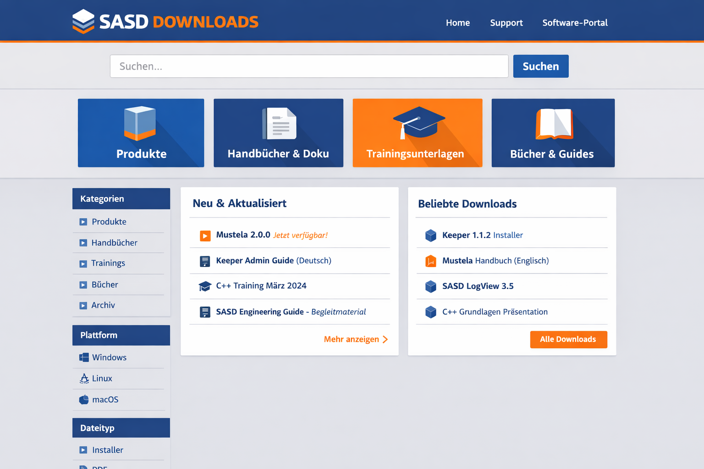

# downloads.sasd.de

A lightweight, MVC-inspired PHP catalog application for `downloads.sasd.de`.

It is designed as a clean first version for a SASD download portal that can serve product packages, manuals, training assets, book companion files, and archived releases. The current implementation uses JSON-based catalog data and is intentionally structured so the storage layer can later move to a database with minimal impact on controllers, views, and routing.



## Highlights

- clean PHP 8.2 project structure
- MVC-inspired architecture
- JSON-backed catalog and repository abstraction
- German and English from day one
- prepared for further languages later
- search and filter entry points
- product and artifact detail pages
- direct download handling through a dedicated controller
- CLI tools for catalog validation and rebuilds

## Why this project exists

`software.sasd.de` and `downloads.sasd.de` have different roles.

- `software.sasd.de` explains products, editions, use cases, and supporting material
- `downloads.sasd.de` distributes the actual artifacts and must also work as a standalone entry point

This application therefore treats the download domain as a searchable artifact catalog instead of a plain file dump.

## Architecture overview

The codebase separates responsibilities clearly:

- **HTTP layer** for routing, request handling, and controllers
- **service layer** for catalog, filtering, and presentation-oriented application logic
- **repository layer** for accessing products and artifacts
- **domain entities** for stable application data structures
- **views** for rendering HTML
- **JSON catalog** as the current storage backend

This structure keeps the system migration-friendly.

## Internationalization

The project is prepared for multilingual growth.

### Current languages

- German (`de`)
- English (`en`)

### How language support is organized

- UI strings live in `resources/lang/*.php`
- product and artifact content is localized inside the catalog JSON files
- locale resolution is handled centrally in the localization service

### Planned future languages

The architecture is ready for further locales such as:

- French (`fr`)
- Spanish (`es`)
- Portuguese (`pt`)
- Italian (`it`)
- Polish (`pl`)
- Turkish (`tr`)
- Arabic (`ar`)
- Hindi (`hi`)
- Korean (`ko`)
- Chinese (`zh`)
- Japanese (`ja`)

When expanding later, the recommended pattern is:

1. add a new language file in `resources/lang/`
2. enable the locale in `config/app.php`
3. extend catalog entries with localized content fields

## Project structure

```text
public/                  Front controller and public assets
app/                     Bootstrap and application wiring
src/                     Application source code
resources/lang/          Translation files
resources/views/         PHP templates
config/                  Application configuration
data/catalog/source/     Editable catalog sources
 data/catalog/generated/ Generated merged catalog
cli/                     Validation and rebuild scripts
docs/                    Repository documentation assets
```

## Local development

### Start with the PHP built-in server

```bash
php -S 127.0.0.1:8080 -t public
```

Open:

```text
http://127.0.0.1:8080
```

## CLI tools

### Validate catalog data

```bash
php cli/validate-catalog.php
```

### Rebuild the generated catalog

```bash
php cli/rebuild-catalog.php
```

## Content workflow

### Add a new product

1. Extend `data/catalog/source/products.json`
2. Add related files to the storage structure
3. Extend `data/catalog/source/artifacts.json`
4. Validate the catalog
5. Rebuild the generated catalog

### Hide, archive, or remove content

For the first version, use status values instead of deleting too early:

- `current`
- `lts`
- `deprecated`
- `archived`
- `hidden`

Recommended approach:

- use `hidden` for temporarily invisible entries
- use `archived` for historical but still retrievable artifacts
- physically remove files only when you are sure they should disappear completely

## Migration path to a database

The current implementation stores catalog data in JSON files, but the code is intentionally prepared for a future repository swap.

That means the long-term migration path is not:

- rewrite the full application

but rather:

- keep routing, controllers, templates, and most service logic
- replace or extend repository implementations
- move catalog persistence from JSON to SQL storage

This is the main architectural reason for the repository interfaces.

## License

This repository is licensed under the MIT License. See [LICENSE](LICENSE).

## Suggested next steps

- internal editorial/upload interface without a database
- checksum generation and detached signatures
- download statistics
- pagination and richer filtering
- automated tests
- audit logging with SASD logging components
